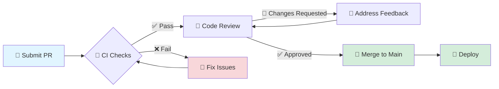

<div align="center">


# 🤝 Contributing to Fully Community

<p align="center">
  <strong>First off, thank you for considering contributing! 🎉</strong>
</p>

<p align="center">
  Every contribution helps make this project better for everyone.
</p>

</div>

---

## 📋 Table of Contents

- [Code of Conduct](#-code-of-conduct)
- [Getting Started](#-getting-started)
- [Development Workflow](#-development-workflow)
- [Commit Guidelines](#-commit-guidelines)
- [Pull Request Process](#-pull-request-process)
- [Coding Standards](#-coding-standards)
- [Testing Guidelines](#-testing-guidelines)
- [Documentation](#-documentation)

---

## 📜 Code of Conduct

> [!IMPORTANT]
> This project adheres to a Code of Conduct. By participating, you are expected to uphold these standards.

**Our Standards:**

- 🤝 Be respectful and inclusive
- 💬 Use welcoming and inclusive language
- 🎯 Focus on what is best for the community
- 🙏 Show empathy towards other community members

---

## 🚀 Getting Started

### 1️⃣ Fork the Repository

```bash
# Fork via GitHub UI, then clone your fork
git clone https://github.com/YOUR_USERNAME/fullycommunity.git
cd fullycommunity
```

### 2️⃣ Set Up Upstream Remote

```bash
git remote add upstream https://github.com/Mostafa-SAID7/fullycommunity.git
git fetch upstream
```

### 3️⃣ Install Dependencies

```bash
# Backend
cd src && dotnet restore

# Frontend
cd ClientApp && npm install

# AI Agent
cd AiAgent && pip install -r requirements.txt

# Mobile
cd Mobile && flutter pub get
```

### 4️⃣ Create a Branch

```bash
git checkout -b feature/your-feature-name
# or
git checkout -b fix/your-bug-fix
```

---

## 🔄 Development Workflow

```
┌─────────────┐     ┌─────────────┐     ┌─────────────┐
│   Create    │────▶│    Make     │────▶│    Test     │
│   Branch    │     │   Changes   │     │   Locally   │
└─────────────┘     └─────────────┘     └──────┬──────┘
                                               │
┌─────────────┐     ┌─────────────┐     ┌──────▼──────┐
│   Merged!   │◀────│   Review    │◀────│   Create    │
│   🎉        │     │   Process   │     │     PR      │
└─────────────┘     └─────────────┘     └─────────────┘
```

### Keep Your Fork Updated

```bash
git fetch upstream
git checkout main
git merge upstream/main
git push origin main
```

---

## 📝 Commit Guidelines

We follow [Conventional Commits](https://www.conventionalcommits.org/) specification.

### Commit Message Format

```
<type>(<scope>): <subject>

[optional body]

[optional footer]
```

### Types

| Type | Description | Example |
|------|-------------|---------|
| `feat` | New feature | `feat(auth): add password reset` |
| `fix` | Bug fix | `fix(api): resolve null reference` |
| `docs` | Documentation | `docs: update API reference` |
| `style` | Formatting | `style: fix indentation` |
| `refactor` | Code refactoring | `refactor(service): simplify logic` |
| `test` | Adding tests | `test(auth): add login tests` |
| `chore` | Maintenance | `chore: update dependencies` |
| `perf` | Performance | `perf(query): optimize database call` |
| `ci` | CI/CD changes | `ci: add code coverage` |

### Scopes

<table>
<tr>
<th>🏷️ Scope</th>
<th>📝 Description</th>
<th>💡 Example</th>
</tr>
<tr>
<td><code>api</code></td>
<td>Backend API</td>
<td><code>fix(api): resolve null reference</code></td>
</tr>
<tr>
<td><code>web</code></td>
<td>Angular frontend</td>
<td><code>feat(web): add dark mode</code></td>
</tr>
<tr>
<td><code>mobile</code></td>
<td>Flutter app</td>
<td><code>fix(mobile): resolve login issue</code></td>
</tr>
<tr>
<td><code>ai</code></td>
<td>AI Agent</td>
<td><code>feat(ai): improve response quality</code></td>
</tr>
<tr>
<td><code>auth</code></td>
<td>Authentication</td>
<td><code>feat(auth): add 2FA support</code></td>
</tr>
<tr>
<td><code>db</code></td>
<td>Database</td>
<td><code>perf(db): optimize queries</code></td>
</tr>
<tr>
<td><code>ci</code></td>
<td>CI/CD pipelines</td>
<td><code>ci: add coverage reports</code></td>
</tr>
<tr>
<td><code>docs</code></td>
<td>Documentation</td>
<td><code>docs: update setup guide</code></td>
</tr>
</table>

### Examples

<details>
<summary><strong>✅ Good Commit Examples</strong></summary>

```bash
feat(auth): implement JWT refresh token
fix(web): resolve routing issue on profile page
docs(api): add authentication endpoints
test(auth): add unit tests for AuthService
chore(deps): update Angular to v19
perf(db): optimize user query with indexing
```

</details>

<details>
<summary><strong>❌ Bad Commit Examples</strong></summary>

```bash
fixed stuff
WIP
update
changes
asdf
```

> [!WARNING]
> Commits like these will be rejected during code review. Please follow the conventional commits format.

</details>

---

## 🔀 Pull Request Process

> [!NOTE]
> Before submitting a PR, please ensure all checks pass and your code follows our guidelines.

### Before Submitting

**Quality Checklist:**

- [ ] 🧪 All tests pass locally
- [ ] 📝 Code follows style guidelines
- [ ] 📖 Documentation updated (if needed)
- [ ] 🔍 Self-review completed
- [ ] 🏷️ Appropriate labels added

### PR Title Format

```
<type>(<scope>): <description>
```

### PR Template

When you create a PR, please fill out the template:

```markdown
## 📋 Description
Brief description of changes.

## 🔗 Related Issues
Fixes #(issue number)

## 🧪 Testing
- [ ] Unit tests added/updated
- [ ] Integration tests added/updated
- [ ] Manual testing completed

## 📸 Screenshots (if applicable)
Add screenshots for UI changes.

## ✅ Checklist
- [ ] Code follows project style
- [ ] Self-review completed
- [ ] Tests pass
- [ ] Documentation updated
```

### Review Process



**Timeline:**

1. 🤖 **Automated checks** run (CI, linting, tests) - *~5 minutes*
2. 👀 **Code review** by maintainers - *1-3 days*
3. 💬 **Address feedback** if any - *As needed*
4. ✅ **Approval** from at least 1 maintainer
5. 🚀 **Merge** to main branch and deploy

---

## 💻 Coding Standards

### 🔷 C# (.NET)

```csharp
// ✅ Use meaningful names
public async Task<User> GetUserByIdAsync(Guid userId)

// ✅ Use async/await properly
public async Task<IActionResult> CreateUser(CreateUserDto dto)
{
    var user = await _userService.CreateAsync(dto);
    return CreatedAtAction(nameof(GetById), new { id = user.Id }, user);
}

// ✅ Use records for DTOs
public record UserDto(Guid Id, string Email, string FirstName);
```

### 🌐 TypeScript (Angular)

```typescript
// ✅ Use standalone components
@Component({
  selector: 'app-profile',
  standalone: true,
  imports: [CommonModule, FormsModule],
  template: `...`
})
export class ProfileComponent {}

// ✅ Use signals for state
currentUser = signal<User | null>(null);

// ✅ Use inject() function
private authService = inject(AuthService);
```

### 🐍 Python

```python
# ✅ Use type hints
async def get_user(user_id: str) -> dict:
    ...

# ✅ Use Pydantic models
class UserRequest(BaseModel):
    email: str
    name: str

# ✅ Use async/await
async def process_request(request: UserRequest) -> dict:
    result = await service.process(request)
    return result
```

### 📱 Dart (Flutter)

```dart
// ✅ Use const constructors
const MyWidget({super.key});

// ✅ Use Provider for state
context.read<AuthProvider>().login(email, password);

// ✅ Use named parameters
Future<bool> login({
  required String email,
  required String password,
}) async { ... }
```

---

## 🧪 Testing Guidelines

### Backend (.NET)

```bash
# Run all tests
dotnet test

# Run with coverage
dotnet test --collect:"XPlat Code Coverage"

# Run specific test
dotnet test --filter "FullyQualifiedName~AuthServiceTests"
```

### Frontend (Angular)

```bash
# Run tests
ng test

# Run with coverage
ng test --code-coverage

# Run headless
ng test --watch=false --browsers=ChromeHeadless
```

### AI Agent (Python)

```bash
# Run tests
pytest

# Run with coverage
pytest --cov=. --cov-report=html

# Run specific test
pytest tests/test_assistant.py -v
```

### Mobile (Flutter)

```bash
# Run tests
flutter test

# Run with coverage
flutter test --coverage
```

---

## 📚 Documentation

### When to Update Docs

- ✅ Adding new features
- ✅ Changing API endpoints
- ✅ Modifying configuration
- ✅ Updating dependencies

### Documentation Files

| File | Purpose |
|------|---------|
| `README.md` | Project overview |
| `CONTRIBUTING.md` | Contribution guide |
| `SECURITY.md` | Security policy |
| `docs/api.md` | API reference |
| `docs/setup.md` | Setup guide |
| `docs/architecture.md` | System design |

---

## 🏷️ Issue Labels

<table>
<tr>
<th>🏷️ Label</th>
<th>📝 Description</th>
<th>🎯 Use Case</th>
</tr>
<tr>
<td><code>bug</code> 🐛</td>
<td>Something isn't working</td>
<td>Report broken functionality</td>
</tr>
<tr>
<td><code>enhancement</code> ✨</td>
<td>New feature request</td>
<td>Suggest new features</td>
</tr>
<tr>
<td><code>documentation</code> 📚</td>
<td>Documentation improvements</td>
<td>Improve docs clarity</td>
</tr>
<tr>
<td><code>good first issue</code> 🌱</td>
<td>Good for newcomers</td>
<td>Start contributing here</td>
</tr>
<tr>
<td><code>help wanted</code> 🆘</td>
<td>Extra attention needed</td>
<td>Community help requested</td>
</tr>
<tr>
<td><code>priority: high</code> 🔴</td>
<td>High priority</td>
<td>Urgent issues</td>
</tr>
<tr>
<td><code>priority: low</code> 🟢</td>
<td>Low priority</td>
<td>Nice to have</td>
</tr>
</table>

---

<div align="center">

### 💖 Thank You for Contributing!

<table>
<tr>
<td align="center" width="33%">

💡 **Questions?**

[Open a Discussion](https://github.com/Mostafa-SAID7/fullycommunity/discussions)

</td>
<td align="center" width="33%">

🐛 **Found a bug?**

[Open an Issue](https://github.com/Mostafa-SAID7/fullycommunity/issues)

</td>
<td align="center" width="33%">

🔒 **Security issue?**

[See SECURITY.md](SECURITY.md)

</td>
</tr>
</table>

---

**Your efforts help make Fully Community better for everyone.** 🙏

<sub>© 2025 Community Car Platform. All rights reserved.</sub>


</div>
