<div align="center">


# 🔒 Security Policy

<p align="center">
  <strong>We take security seriously at Fully Community.</strong>
</p>

<p align="center">
  This document outlines our security practices and how to report vulnerabilities.
</p>

</div>

---

## 📋 Table of Contents

- [Supported Versions](#-supported-versions)
- [Reporting a Vulnerability](#-reporting-a-vulnerability)
- [Security Measures](#-security-measures)
- [Security Best Practices](#-security-best-practices)
- [Dependency Management](#-dependency-management)

---

## ✅ Supported Versions

> [!IMPORTANT]
> We actively maintain and provide security updates for the following versions.

<table>
<tr>
<th>📦 Version</th>
<th>✅ Supported</th>
<th>📝 Notes</th>
<th>🛡️ Security Updates</th>
</tr>
<tr>
<td><strong>1.x.x</strong></td>
<td>✅ Yes</td>
<td>Current release</td>
<td>All security patches</td>
</tr>
<tr>
<td><strong>0.x.x</strong></td>
<td>⚠️ Limited</td>
<td>Previous release</td>
<td>Critical fixes only</td>
</tr>
<tr>
<td><strong>&lt; 0.1.0</strong></td>
<td>❌ No</td>
<td>End of life</td>
<td>No updates</td>
</tr>
</table>

---

## 🚨 Reporting a Vulnerability

> [!CAUTION]
> **Please DO NOT open public issues for security vulnerabilities!**
> 
> Public disclosure of security issues can put all users at risk. Always report security vulnerabilities privately.

### How to Report

> [!IMPORTANT]
> Send security reports to our dedicated security email with detailed information.

**Contact Information:**

1. **Email**: `security@fullycommunity.com`
2. **Subject**: `[SECURITY] Brief description`
3. **Include**:
   - Description of the vulnerability
   - Steps to reproduce
   - Potential impact
   - Suggested fix (if any)
   - Your contact information (optional, for follow-up)

### What to Expect

```mermaid
gantt
    title Security Response Timeline
    dateFormat  HH:mm
    axisFormat %H:%M
    
    section Response
    Acknowledgment (24h)           :done, ack, 00:00, 24h
    Initial Assessment (72h)       :active, assess, after ack, 48h
    Detailed Response (7d)         :crit, response, after assess, 120h
    Fix Development (30-90d)       :fix, after response, 720h
```



<table>
<tr>
<th>⏱️ Timeline</th>
<th>🎯 Action</th>
<th>📋 Details</th>
</tr>
<tr>
<td><strong>24 hours</strong></td>
<td>Acknowledgment</td>
<td>We confirm receipt of your report</td>
</tr>
<tr>
<td><strong>72 hours</strong></td>
<td>Initial Assessment</td>
<td>Severity evaluation and triage</td>
</tr>
<tr>
<td><strong>7 days</strong></td>
<td>Detailed Response</td>
<td>Action plan and timeline</td>
</tr>
<tr>
<td><strong>30-90 days</strong></td>
<td>Fix Deployed</td>
<td>Depending on severity level</td>
</tr>
</table>

### Severity Levels

| Level | Description | Response Time |
|-------|-------------|---------------|
| 🔴 **Critical** | Remote code execution, data breach | 24-48 hours |
| 🟠 **High** | Authentication bypass, SQL injection | 7 days |
| 🟡 **Medium** | XSS, CSRF, information disclosure | 30 days |
| 🟢 **Low** | Minor issues, best practice violations | 90 days |

### Recognition

> [!TIP]
> We appreciate responsible disclosure! Contributors who report valid security issues will be recognized.

**Benefits for Security Researchers:**

- 🏆 Credited in our security acknowledgments (if desired)
- 📜 Added to our Hall of Fame
- 🎁 Eligible for swag (for critical/high severity issues)
- 💼 Professional reference available upon request

---

## 🛡️ Security Measures

### Authentication & Authorization

```
┌─────────────────────────────────────────────────────────┐
│                    Security Layers                       │
├─────────────────────────────────────────────────────────┤
│  🔐 JWT Authentication                                   │
│  ├── Access tokens (short-lived: 60 min)                │
│  ├── Refresh tokens (long-lived: 7 days)                │
│  └── Token rotation on refresh                          │
├─────────────────────────────────────────────────────────┤
│  👤 ASP.NET Identity                                     │
│  ├── Password hashing (PBKDF2)                          │
│  ├── Account lockout (5 failed attempts)                │
│  └── Email confirmation                                 │
├─────────────────────────────────────────────────────────┤
│  🎭 Role-Based Access Control (RBAC)                    │
│  ├── Admin, User roles                                  │
│  └── Endpoint authorization                             │
└─────────────────────────────────────────────────────────┘
```

### Data Protection

| Layer | Protection |
|-------|------------|
| **Transport** | TLS 1.3, HTTPS only |
| **Storage** | Encrypted at rest (AES-256) |
| **Passwords** | Hashed with PBKDF2 |
| **Tokens** | Signed with HMAC-SHA256 |
| **PII** | Encrypted, access logged |

### API Security

```
┌─────────────────────────────────────────────────────────┐
│                    API Protection                        │
├─────────────────────────────────────────────────────────┤
│  🚦 Rate Limiting                                        │
│  ├── 100 requests/minute (authenticated)                │
│  └── 20 requests/minute (anonymous)                     │
├─────────────────────────────────────────────────────────┤
│  🛡️ Input Validation                                    │
│  ├── Request validation (FluentValidation)              │
│  ├── SQL injection prevention (parameterized queries)   │
│  └── XSS prevention (output encoding)                   │
├─────────────────────────────────────────────────────────┤
│  📝 Logging & Monitoring                                │
│  ├── Security events logged                             │
│  ├── Failed login attempts tracked                      │
│  └── Anomaly detection                                  │
└─────────────────────────────────────────────────────────┘
```

### Infrastructure Security

| Component | Security Measure |
|-----------|------------------|
| **Containers** | Non-root users, read-only filesystem |
| **Secrets** | Azure Key Vault / GitHub Secrets |
| **Network** | Private VNet, NSG rules |
| **Database** | Firewall rules, encrypted connections |
| **CI/CD** | Signed commits, protected branches |

---

## 🔐 Security Best Practices

### For Contributors

#### ✅ DO

```bash
# Use environment variables for secrets
export JWT_SECRET="your-secret-here"

# Use parameterized queries
await _context.Users.FirstOrDefaultAsync(u => u.Id == userId);

# Validate all inputs
if (!ModelState.IsValid) return BadRequest(ModelState);

# Use HTTPS everywhere
services.AddHttpsRedirection(options => options.HttpsPort = 443);
```

#### ❌ DON'T

```bash
# Never commit secrets
❌ "ConnectionString": "Server=prod;Password=secret123"

# Never use string concatenation for queries
❌ $"SELECT * FROM Users WHERE Id = '{userId}'"

# Never trust user input
❌ return File(userInput, "application/octet-stream");

# Never disable security features
❌ [AllowAnonymous] on sensitive endpoints
```

### Secure Coding Checklist

> [!NOTE]
> Use this checklist to ensure your code follows security best practices before submitting a PR.

**Security Requirements:**

- [ ] 🔐 Authentication required for sensitive endpoints
- [ ] 🎭 Authorization checks in place
- [ ] ✅ Input validation on all user inputs
- [ ] 🛡️ Output encoding for displayed data
- [ ] 📝 Security events logged
- [ ] 🔑 Secrets stored securely (not in code)
- [ ] 🔒 HTTPS enforced
- [ ] 🚦 Rate limiting configured

> [!WARNING]
> Failing to implement these security measures can lead to serious vulnerabilities. When in doubt, ask for a security review!

---

## 📦 Dependency Management

### Automated Security Scanning

| Tool | Purpose | Frequency |
|------|---------|-----------|
| **Dependabot** | Dependency updates | Daily |
| **CodeQL** | Code analysis | On PR |
| **npm audit** | JS vulnerabilities | On CI |
| **safety** | Python vulnerabilities | On CI |
| **dotnet security-scan** | .NET vulnerabilities | On CI |

### Update Policy

```
┌─────────────────────────────────────────────────────────┐
│              Dependency Update Policy                    │
├─────────────────────────────────────────────────────────┤
│  🔴 Critical vulnerabilities  →  Patch within 24 hours  │
│  🟠 High vulnerabilities      →  Patch within 7 days    │
│  🟡 Medium vulnerabilities    →  Patch within 30 days   │
│  🟢 Low vulnerabilities       →  Next release cycle     │
│  📦 Regular updates           →  Monthly review         │
└─────────────────────────────────────────────────────────┘
```

### Checking for Vulnerabilities

<details>
<summary><strong>🔷 .NET Backend</strong></summary>

```bash
# Check for vulnerable packages
dotnet list package --vulnerable

# Check for outdated packages
dotnet list package --outdated

# Update packages
dotnet add package <PackageName>
```

</details>

<details>
<summary><strong>🌐 Node.js Frontend</strong></summary>

```bash
# Audit dependencies
npm audit

# Fix vulnerabilities automatically
npm audit fix

# Force fix (may introduce breaking changes)
npm audit fix --force
```

</details>

<details>
<summary><strong>🐍 Python AI Agent</strong></summary>

```bash
# Install safety
pip install safety

# Check for vulnerabilities
safety check -r requirements.txt

# Generate detailed report
safety check -r requirements.txt --json
```

</details>

<details>
<summary><strong>📱 Flutter Mobile</strong></summary>

```bash
# Check for outdated packages
flutter pub outdated

# Update dependencies
flutter pub upgrade

# Analyze project
flutter analyze
```

</details>

---

## 🔍 Security Headers

Our API includes these security headers:

```http
X-Content-Type-Options: nosniff
X-Frame-Options: DENY
X-XSS-Protection: 1; mode=block
Strict-Transport-Security: max-age=31536000; includeSubDomains
Content-Security-Policy: default-src 'self'
Referrer-Policy: strict-origin-when-cross-origin
Permissions-Policy: geolocation=(), microphone=(), camera=()
```

---

## 📊 Security Compliance

| Standard | Status |
|----------|--------|
| OWASP Top 10 | ✅ Addressed |
| GDPR | ✅ Compliant |
| SOC 2 | 🔄 In Progress |

---

## 🔗 Security Resources

- [OWASP Cheat Sheets](https://cheatsheetseries.owasp.org/)
- [Microsoft Security Best Practices](https://docs.microsoft.com/en-us/security/)
- [Angular Security Guide](https://angular.io/guide/security)
- [Flutter Security](https://flutter.dev/security)

---

<div align="center">

### 🛡️ Security is Everyone's Responsibility

<table>
<tr>
<td align="center" width="50%">

📧 **Security Email**

`security@fullycommunity.com`

For private vulnerability reports

</td>
<td align="center" width="50%">

🐛 **General Issues**

[GitHub Issues](https://github.com/Mostafa-SAID7/fullycommunity/issues)

For non-security bugs

</td>
</tr>
</table>

---

**Thank you for helping keep Fully Community secure!** 🙏

<sub>© 2025 Community Car Platform. All rights reserved.</sub>


</div>
