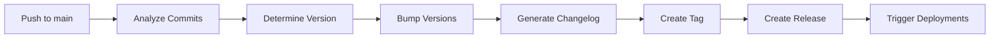

# 📦 Versioning and Release Automation

Complete guide for automated versioning and release management in the Fully Community Platform.

## 📋 Table of Contents

- [Overview](#overview)
- [Semantic Versioning](#semantic-versioning)
- [Automated Workflows](#automated-workflows)
- [Manual Version Bumping](#manual-version-bumping)
- [Changelog Generation](#changelog-generation)
- [Release Process](#release-process)
- [Best Practices](#best-practices)

---

## 🎯 Overview

Our platform uses automated versioning and release management to:

- **Automatically bump versions** based on commit messages
- **Generate changelogs** from git history
- **Create GitHub releases** with detailed notes
- **Trigger deployments** across all components
- **Maintain consistency** across frontend, backend, AI agent, and mobile

---

## 📊 Semantic Versioning

We follow [Semantic Versioning 2.0.0](https://semver.org/):

```
MAJOR.MINOR.PATCH
```

### Version Bump Rules

| Commit Type | Version Bump | Example |
|-------------|--------------|---------|
| `feat!:` or `BREAKING CHANGE:` | **MAJOR** | 1.0.0 → 2.0.0 |
| `feat:` or `feature:` | **MINOR** | 1.0.0 → 1.1.0 |
| `fix:` or `bugfix:` | **PATCH** | 1.0.0 → 1.0.1 |
| Other commits | **PATCH** | 1.0.0 → 1.0.1 |

### Commit Message Format

Use [Conventional Commits](https://www.conventionalcommits.org/):

```bash
<type>(<scope>): <description>

[optional body]

[optional footer]
```

**Examples:**

```bash
# Minor version bump (new feature)
feat(auth): add OAuth2 authentication

# Patch version bump (bug fix)
fix(api): resolve null reference exception

# Major version bump (breaking change)
feat(api)!: change authentication endpoint structure

BREAKING CHANGE: Authentication endpoints now require v2 format
```

---

## 🤖 Automated Workflows

### 1. Semantic Release (Automatic)

**Trigger:** Push to `main`, `develop`, `beta`, or `alpha` branches

**File:** `.github/workflows/automation/semantic-release.yml`

**What it does:**
1. Analyzes commits since last release
2. Determines version bump type
3. Updates all component versions
4. Generates changelog
5. Creates git tag
6. Creates GitHub release
7. Triggers deployments

**Usage:**
```bash
# Just push to main - it runs automatically!
git push origin main
```

**Manual trigger:**
```bash
# Via GitHub Actions UI
Actions → Semantic Release → Run workflow
  - Select release type: auto/major/minor/patch/prerelease
```

### 2. Manual Version Bump

**Trigger:** Manual workflow dispatch

**File:** `.github/workflows/automation/version-bump.yml`

**What it does:**
1. Bumps version manually
2. Updates selected components
3. Optionally creates release

**Usage:**
```bash
# Via GitHub Actions UI
Actions → Manual Version Bump → Run workflow
  - Version type: major/minor/patch/custom
  - Custom version: (if custom selected)
  - Components: all/frontend/backend/ai-agent/mobile
  - Create release: yes/no
```

### 3. Changelog Generator

**Trigger:** Push to `main` or manual

**File:** `.github/workflows/automation/changelog-generator.yml`

**What it does:**
1. Generates comprehensive changelog
2. Groups commits by type
3. Creates component-specific changelogs
4. Commits changes back

**Usage:**
```bash
# Automatic on push to main

# Manual trigger
Actions → Changelog Generator → Run workflow
  - From tag: (optional)
  - To ref: HEAD (default)
```

---

## 🛠️ Manual Version Bumping

### Using PowerShell (Windows)

```powershell
# Patch version bump (1.0.0 → 1.0.1)
.\scripts\version-bump.ps1

# Minor version bump (1.0.0 → 1.1.0)
.\scripts\version-bump.ps1 -BumpType minor

# Major version bump (1.0.0 → 2.0.0)
.\scripts\version-bump.ps1 -BumpType major

# Custom version
.\scripts\version-bump.ps1 -CustomVersion "2.5.3"

# Without commit
.\scripts\version-bump.ps1 -NoCommit

# Without tag
.\scripts\version-bump.ps1 -NoTag
```

### Using Bash (Linux/Mac)

```bash
# Make script executable
chmod +x scripts/version-bump.sh

# Patch version bump
./scripts/version-bump.sh patch

# Minor version bump
./scripts/version-bump.sh minor

# Major version bump
./scripts/version-bump.sh major

# Custom version
./scripts/version-bump.sh 2.5.3
```

### What Gets Updated

When you bump the version, these files are automatically updated:

#### Frontend
- `ClientApp/package.json` → `version`

#### Backend
- `src/**/*.csproj` → `<Version>`
- `src/API/appsettings.json` → `Version`

#### AI Agent
- `AiAgent/__version__.py` → `__version__`
- `AiAgent/setup.py` → `version`

#### Mobile
- `Mobile/Android/app/build.gradle` → `versionCode`, `versionName`
- `Mobile/iOS/Info.plist` → `CFBundleShortVersionString`

#### Root
- `VERSION` → version number
- `.devops/docker-compose.yml` → image tags

---

## 📝 Changelog Generation

### Automatic Generation

Changelogs are automatically generated on every push to `main`:

```markdown
# Changelog

## [1.2.0] - 2024-12-10

### ✨ Features
- feat(auth): add OAuth2 support (abc123)
- feat(api): implement rate limiting (def456)

### 🐛 Bug Fixes
- fix(ui): resolve button alignment issue (ghi789)

### 📚 Documentation
- docs: update API documentation (jkl012)

[View Full Changelog](https://github.com/owner/repo/compare/v1.1.0...v1.2.0)
```

### Manual Generation

```bash
# Generate changelog for all history
Actions → Changelog Generator → Run workflow

# Generate from specific tag
Actions → Changelog Generator → Run workflow
  - From tag: v1.0.0
  - To ref: HEAD
```

### Component Changelogs

Each component gets its own changelog:

- `ClientApp/CHANGELOG/CHANGELOG.md` - Frontend changes
- `src/CHANGELOG/CHANGELOG.md` - Backend changes
- `AiAgent/CHANGELOG/CHANGELOG.md` - AI Agent changes
- `Mobile/CHANGELOG/CHANGELOG.md` - Mobile changes

---

## 🚀 Release Process

### Automatic Release Flow



### Manual Release Flow

1. **Prepare Release**
   ```bash
   # Update version
   ./scripts/version-bump.ps1 -BumpType minor
   
   # Review changes
   git diff
   ```

2. **Commit and Tag**
   ```bash
   git add .
   git commit -m "chore(release): bump version to 1.2.0"
   git tag -a v1.2.0 -m "Release v1.2.0"
   ```

3. **Push**
   ```bash
   git push origin main
   git push origin v1.2.0
   ```

4. **Create Release**
   - GitHub automatically creates release from tag
   - Or manually via GitHub UI

### Release Notes Template

Our releases include:

- **Version badge** and download stats
- **What's Changed** - Grouped by type
- **Contributors** - All contributors
- **Installation instructions** - Docker and Git
- **Links** - Documentation, issues, changelog

---

## 🎯 Best Practices

### Commit Messages

✅ **Good:**
```bash
feat(auth): add two-factor authentication
fix(api): resolve memory leak in user service
docs(readme): update installation instructions
```

❌ **Bad:**
```bash
update code
fix bug
changes
```

### Version Bumping

- **Use semantic release** for automatic versioning
- **Manual bumps** only for special cases
- **Always test** before releasing
- **Update changelog** if manual release

### Release Timing

- **Patch releases** - As needed for bug fixes
- **Minor releases** - Weekly or bi-weekly
- **Major releases** - Monthly or quarterly
- **Hotfixes** - Immediately for critical issues

### Pre-release Versions

For beta/alpha releases:

```bash
# Create pre-release tag
git tag -a v1.2.0-beta.1 -m "Beta release"
git push origin v1.2.0-beta.1

# Workflow automatically marks as pre-release
```

---

## 🔧 Configuration

### Semantic Release Config

Edit `.github/workflows/automation/semantic-release.yml`:

```yaml
# Change branches that trigger releases
on:
  push:
    branches:
      - main
      - develop  # Add more branches
```

### Version Bump Config

Edit `scripts/version-bump.ps1` or `scripts/version-bump.sh`:

```bash
# Change default bump type
[string]$BumpType = 'minor'  # Instead of 'patch'
```

### Changelog Config

Edit `.github/workflows/automation/changelog-generator.yml`:

```yaml
# Customize commit grouping
echo "### ✨ Features" >> CHANGELOG.md
git log --grep="^feat" >> CHANGELOG.md
```

---

## 📚 Additional Resources

- [Semantic Versioning](https://semver.org/)
- [Conventional Commits](https://www.conventionalcommits.org/)
- [Keep a Changelog](https://keepachangelog.com/)
- [GitHub Releases](https://docs.github.com/en/repositories/releasing-projects-on-github)

---

## 🆘 Troubleshooting

### Version Mismatch

If versions are out of sync:

```bash
# Run version bump to sync all
./scripts/version-bump.ps1 -CustomVersion "1.2.3"
```

### Failed Release

If automatic release fails:

1. Check workflow logs in Actions tab
2. Verify commit messages follow convention
3. Ensure no conflicts in version files
4. Manually trigger release workflow

### Missing Changelog

If changelog is not generated:

```bash
# Manually trigger changelog generator
Actions → Changelog Generator → Run workflow
```

---

## 📞 Support

For issues or questions:

- **GitHub Issues**: [Report a bug](https://github.com/owner/repo/issues/new?template=bug_report.md)
- **Discussions**: [Ask a question](https://github.com/owner/repo/discussions)
- **Documentation**: [View all docs](https://github.com/owner/repo/tree/main/docs)

---

<div align="center">

**Made with ❤️ by the Fully Community Team**

[⭐ Star us on GitHub](https://github.com/owner/repo) • [📖 Documentation](https://github.com/owner/repo/tree/main/docs) • [🐛 Report Bug](https://github.com/owner/repo/issues)

</div>
